# Speeding to Success: Evaluating the Predictive Power of NFL Combine Agility Drills on Receiver Performance**

Henry Kraessig, Calvin Lamosse, Thatch Phypers, Anna Turmail

April 2025

## Abstract 
	The NFL Combine is an event held each year during the offseason. Prospects participate in several drills that measure their capabilities as potential professional players. It is debated whether or not the Combine is a good representation of how well an athlete will perform on an NFL team. To explore this question, we focused our efforts on the three positions responsible for running routes and catching balls during passing plays: tight ends, wide receivers, and running backs. In an effort to analyze the implications of Combine drills that most relate to in-game scenarios, we narrowed our scope to focus on the 40-yard dash, three-cone drill, and shuttle run. For assessing the performance of players during games, we used a metric built into our data –Expected Points Added (EPA); and a metric that we developed ourselves called Openness, which determines the amount of separation a receiver gets from defenses in a given play. We found that EPA was not a good portrayal of individual performances and that it had no significant relationships with any Combine measures. Openness, however, had meaningful relationships with the height and weight of all three positions, and with the 40-yard times of tight ends and running backs.

## 1\. Introduction  
	In the National Football League (NFL), teams are allowed to have 53 players signed to their roster. Within this relatively limited group, teams must try to maximize talent in order to improve their chances of winning on game day. One of the most valuable ways for teams to build successful rosters is from the players they choose in the draft.   
	Every year during the offseason, the NFL Draft commences, with each of the 32 teams getting to pick 7 players who are not currently in the league. This is one of the best ways for teams to secure new, young talent for their rosters, making these 7 picks extremely important for team success in the future. In order to help teams make informed decisions about who to draft, there are full-time scouts who are completely dedicated to identifying special talents and skills at lower levels of football. To help simplify and standardize scouting metrics, in 1982 the first NFL Combine was held \[1\], inviting select draft prospects from across the nation to come and showcase their skills and athletic capabilities in front of NFL teams.   
	Today, the NFL Combine is a nationally televised event that puts prospects through a series of drills to measure their strength, speed, and agility. Depending on a prospect’s chosen position, they will be scouted based on different attributes. For example, Offensive Linemen do lots of blocking during games, so they will be judged based on their performance in strength-related drills. Conversely, a wide receiver’s job in games is to run quickly executed movement patterns–called routes, so they are expected to perform the best in speed-related drills. This study will focus on three drills in particular: the Three-Cone Drill, the Shuttle Run, and the 40-Yard Dash.   
The Three-Cone Drill spaces three cones 5 yards apart in an upside-down L-shape. Players are timed in this drill and start at the end of the L. They run as fast as they can to the next cone, then run back to the starting cone, then turn to run around the second cone towards the third cone, where they pivot and run back around the first two cones again (see Figure 1). This drill aims to measure how quickly a prospect can change direction and explode away from a pivot point, something that mirrors the motions that receivers go through while running routes, particularly short ones.   
The Shuttle Run is also a timed drill that measures speed and agility. Three cones are set up in a line, each spaced 5 yards from the last, with the prospect starting at the middle cone. They start running towards one of the cones located 5 yards to the side, they then touch the ground by the cone, then turn and run 10 yards to the far cone, touch the ground, and run 5 yards back to the middle cone (see Figure 1). This, too, measures how quickly a prospect can change direction and explode from a pivot point, but also benefits more from raw speed than the three-cone drill.   
 Finally, we will be looking at the 40-Yard Dash, an aptly named speed test. Prospects line up at the end of a 40-yard strip of field and are timed to see how long it takes them to run from one end to the other (see Figure 1). This drill focuses on straight-line speed and a prospect’s ability to reach their full speed in a short distance; something that is often important while running deep routes.   
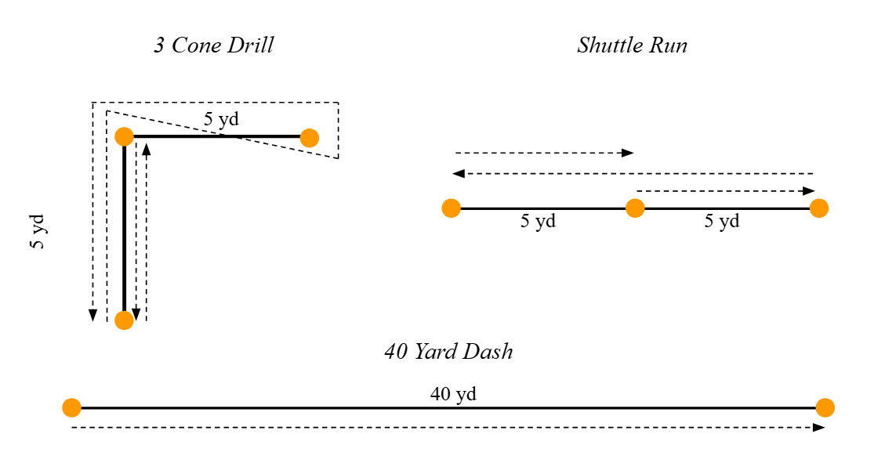  
Figure 1: Combine speed drill diagrams. 

This study will be conducted on prospects who play as tight ends, running backs, and wide receivers, since, as touched on earlier, different positions are expected to perform better at certain aspects of the game. These three positions are supposed to be relatively agile since they serve as the primary route runners for every team. This means they need to excel at getting open and creating separation from their opposing defender. Intuitively, the Three-Cone Drill, Shuttle Run, and 40-Yard Dash results should most directly relate to the performance of each of these positions on game day. In Figure 2, examples of some common route patterns can be seen with the average of that route type highlighted, while specific instances of the route type can be seen plotted alongside it. When comparing these route shapes to the shapes of the drill, it can be seen that some shapes and movements look similar between the in-game routes and the Combine drills such as the short burst in the Angle route, and the longer, straighter Wheel route.

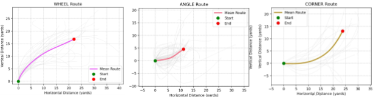

Figure 2: Example average routes ran in-game. 

To analyze players’ performances on these routes we will utilize metrics such as Expected Points Added and our own specially designed Openness metric. Expected Points Added measures how a given play affects the probability that a team will score on a given possession. Openness measures how adept a player is at creating separation from the defense while running routes. Through these measurements we will attempt to quantify a player’s abilities on the field to then compare them to the results of the Combine drills to see if these drills can be used to predict on-field success of prospects. 

## 2\. Methods

*2.1. Data Sources*  
	This study relied on data released by the NFL in the Big Data Bowl (BDB) \[2\] and on data from Pro Football Reference \[3\]. The data from Pro Football Reference was a 22-year collection of every prospect’s Combine results since 2000\. Within this data, results for each prospect in the Three-Cone Drill, Shuttle Run, 40-Yard Dash, as well as position, height, weight, and other metrics, were collected. We did not include Combine scores any more recent than the 2022 Combine since the tracking data released in the Big Data Bowl was from the 2022 NFL Season. Every year, the NFL hosts the Big Data Bowl, a sports analytics contest that releases proprietary tracking data to the public in an effort to continue the evolution of how advanced data collection can be used in sports. This year, the NFL released 9 weeks' worth of data from the 2022-23 season. Within this data, a myriad of stats about each game, play, player, and frame within each play are tracked. For instance, within the player tracking data, every player’s position is recorded every tenth of a second throughout every play through their X and Y coordinates. Another dataset within the BDB data is player play data, which records metrics such as the type of route run on a given play by a given player. 

*2.1.1. Combine Data*  
	To prepare the data for analysis, significant filtering and cleaning were performed on the NFL Combine results and player tracking data. The first step involved aggregating multiple years of Combine data from Pro Football Reference into a master dataset. From this dataset, only players at the wide receiver (WR), running back (RB), and tight end (TE) positions were retained, as these were the focus of the study. Additionally, only players who ran routes in the NFL Big Data Bowl 2025 data were included. Irrelevant metrics, such as bench press repetitions, were removed to streamline the dataset, as only speed event results were needed for this analysis.  
After initial filtering, the Combine dataset was merged with player information using the fuzzyjoin package in R, linking records based on player names. This step ensured that all retained players had positional and biometric data available. To further refine the dataset, player height, initially stored in a feet-inches format, was converted into total inches for consistency in numerical analysis. Additionally, player positions were one-hot encoded to allow for easier incorporation into machine learning models and statistical analysis.  
Overall, 59 % of our route‑runners had at least one missing speed‐drill result (40 yd dash, 3‑cone drill, shuttle), and 33 % had all three missing; only 41 % had a complete set of speed times.  
We created two versions of the Combine dataset:

1. Full cohort: all WR/RB/TE route‑runners, including those with zero, one, two, or three missing speed drills.  
2. “≤ 2 missing” subset: route‑runners missing at most two of the three speed drills—i.e. at least partial participation in the speed events. This ends up being  66% of our original data

| Drill | % Missing (Full cohort) | % missing (≤ 2 missing) |
| :---- | ----- | ----- |
| 40 yd dash | 34.5% | 1.6% |
| 3-cone drill | 57.4% | 35.9% |
| Shuttle run | 54.6% | 31.8% |
| Any | 59.1% | 38.5% |

Table 1: summarizes the proportion of missing values in each speed metric for these two datasets

Our exploratory assessment showed that missing speed‑drill results did not cluster by position, height, weight, or Combine year, suggesting that omissions were plausibly missing at random. To address these gaps while preserving the natural variability of the data, we applied the mice package’s predictive mean matching (PMM) algorithm. PMM imputes each missing value by randomly drawing from observed cases with similar predictor profiles (weight, 40 yd dash, shuttle, height), which ensures that imputed times remain within the realm of plausible performance and avoids the variance shrinkage often seen with purely model‑based predictions. By limiting our dataset to players missing at most two drills (see Table 1), we reduced the overall imputation burden by roughly two‑thirds, further strengthening the reliability of our imputed Combine statistics.  
To evaluate the quality of our imputation, we visualized the distributions of observed and imputed values for each Combine speed drill using kernel density overlays (Figure 2). Since all numeric variables were normalized prior to imputation and filtering, we expected both distributions to be centered around zero with a standard deviation near one. The density plots show that the imputed values closely follow the shape, center, and spread of the observed data for each drill. This alignment indicates that our use of PMM successfully preserved the original distributional characteristics of the data, reinforcing the validity of our imputations and minimizing the risk of bias introduced through modeling.  

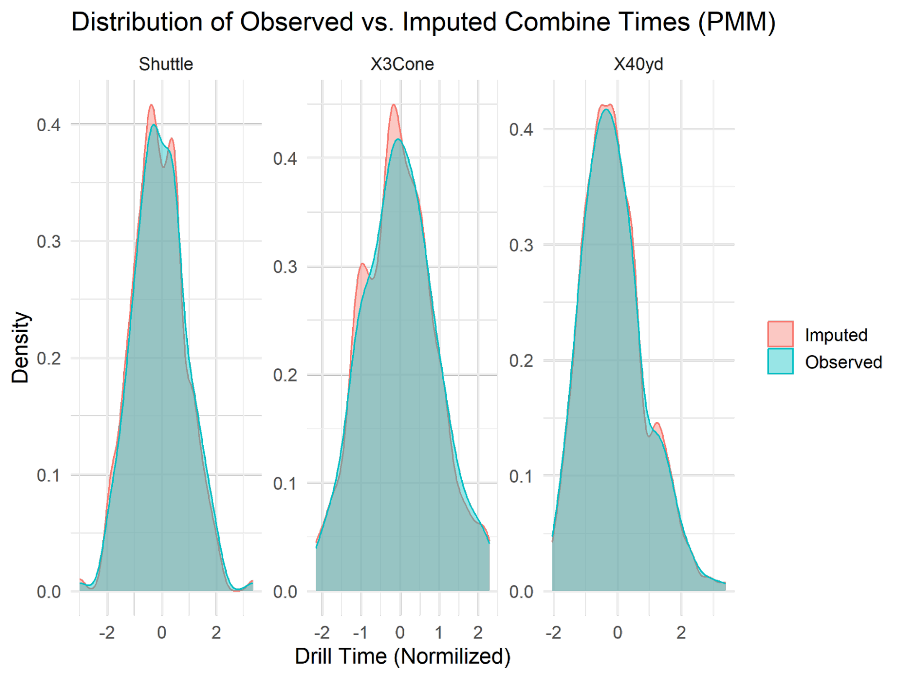

Figure 3: Density overlays of observed vs. PMM‐imputed

A key finding from exploratory data analysis was that players missing two or fewer speed-related Combine metrics had a similar distribution of on-field performance (measured by the number of routes run) compared to those with complete Combine speed data, giving us further justification to be able to use and impute player data who have partial Combine data. These findings reinforced the decision to limit our data to players with partial Combine stats, as it reduced the extent of artificial data while maintaining the integrity of the player Combine dataset.

*2.1.2. Tracking Data*  
Prior to merging the Combine data with the tracking data, much cleaning of the tracking data was required in order to optimize the size of the dataframes we were working with. The total amount of data the NFL released for this year’s BDB totaled over 8 gigabytes of CSV files. Thus, due to the sheer size of the data, we tried to keep datasets separate and minimize them for as long as possible throughout the feature design stage of this study. For instance, we were able to nearly halve the frame-by-frame tracking dataset’s size by filtering out frames before the ball was snapped. From there, we were able to Combine the player tracking data with the player play data in order to be able to label which players were running which routes on each play, allowing for more in-depth analysis later on. 

*Measures/Metrics for On-field Success*

- Expected points added  
- Openness (ellipses/distances)

	To measure the on-field success of players, we took multiple approaches to try and isolate singular players and their talents from their team’s overall abilities as much as possible. In doing so, we found multiple viable methods to approach the problem, which we will go into depth explaining here. 

*EPA*  
	One popular statistic to measure the success of a specific play is the Expected Points Added (EPA). Before being able to understand what EPA is, we must first explore Expected Points (EP). EP is a metric that attempts to weigh the importance of yards gained during a play based on down and distance, position on the field, and other factors. This metric exists in an effort to acknowledge that in some situations, a 5-yard gain may be exactly what a team needs, but in other situations, it may be a gain that falls short of a team’s goals. EPA measures how well a team performs relative to expectations by comparing changes in Expected Points. To relate this to a per-play basis, we look at how a team’s Expected Points on a drive change from play to play. For example, if a team has an EP of 1.05 when they have the ball at the 45-yard line on 3rd and 7, then they complete a 10-yard pass to then be positioned at the 35-yard line on 1st and 10 they might have a new EP of 2.37, meaning the EPA of that play would be 2.37 \- 1.05 \= 1.32. Simply put, EPA is calculated with the following formula.

	EPA is recorded in the NFL’s BDB-released data within their play data, allowing us to measure each play individually and attribute that play’s EPA to the key players involved. However, this metric is flawed due to the fact that it does not isolate a single player’s talent from their team’s abilities very well. For instance, even if a skilled wide receiver runs a perfect route, creating a lot of separation from their defender, their quarterback must have the skill to recognize that they are open and accurately throw the ball to them. This introduces a lot of unaccounted-for variability in the EPA metric, which although interesting to look at, will not fully isolate the skill of the receiving player which we are interested in. Because of this shortcoming, we decided to design a separate metric we refer to as “Openness” which aims to limit that variability. 

*2.2. Feature Engineering*  
	The potential issue with evaluating EPA as a metric to analyze individual player performance is that it attempts to attribute a team-based metric to one player. For wide receivers, tight ends, and running backs, passing game results are largely dependent on the quarterback. Because the quarterback decides during each passing play whom to pass to, simply measuring the play outcome ignores the quality of play for each route runner who did not receive the ball. We decided to assign an EPA of 0 for players in plays where they were not targeted to try to avoid misattributing skill to underperforming players who are simply on the field more often with very talented teammates. For example, it would be irresponsible to give a player like Brandon Powell, a third-string WR for the Vikings more positive EPA results just because he ran routes alongside Justin Jefferson, a consensus top 5 WR in the league, than someone like John Jiles of the Patriots who does not run routes alongside a top talent in the league. Assigning the EPA of a play to all route runners involved would then skew results so that players with better teammates would artificially perform better within this metric. Additionally, quarterback skill is highly variable across teams, so an ideal statistic to isolate route-running quality would ignore the effects of the quarterback.   
	To do this, we developed two metrics to attempt to quantify openness, both of which focus on how well a route runner creates separation from defenders. 

*2.2.1. Euclidean Distance*  
	Our first approach was to use the Euclidean distance of a player from their nearest defender throughout a play to measure openness. In order to do so, we used the following formula where *RouteRunner* and *Defender* represent players’ respective positions and *i* indexes individual frames in time. 

Although in the player play dataset released by the NFL in the BDB, there is a tracking metric that assigns a specific player as the primary defender for each route runner, we found that the nearest defender to a route runner often changed throughout a play. Because of this inconsistency, we decided to disregard the idea of using the distance to the player’s primary defender entirely, at the cost of far more computation. This came in the form of computing the distance from the route runner to each opponent at each frame to record the minimum of those distances.   
	After computing these distances on a frame-by-frame basis, we then attempted to identify what are referred to as breakpoints since after a breakpoint is when the openness of a player matters the most. A breakpoint is the point in a route where a receiver makes their move to try and get separation from their defender, and therefore where a quarterback will look for their receiver to be open. For example, in Figure 3, the breakpoint appears to be at frame 160, where receiver Stefon Diggs cuts inside, deviating from his previously straight path. Soon after that breakpoint, quarterback Josh Allen recognizes that Diggs is open and targets him. With our Euclidian openness statistic, in order to try and identify the breakpoint of a route, we tried looking for where the largest change in direction between frames for each route type was and labeling that as a breakpoint. Then, to find how open the player was on the play, we looked at the maximum distance from their nearest defender they achieved after that breakpoint. Finally, for each route type a player ran, we took the maximum distances achieved on each play of that route type and averaged them to find how open each player got on each route type. Intuition and definition tell us that the player with the most space between them and whoever is covering them is the most open player on the field, hence our gravitation towards this fairly simple approach. However, as we found with early analysis of this metric, much nuance of actual in-game openness was lost in this simplification. For instance, as can be seen in Figure 3, when the quarterback (Josh Allen) recognizes that his receiver (Stefon Diggs) is open, his receiver is closer to his defender than at the start of the play, but because of the speed he is moving at and the direction he is headed, his quarterback knows he is about to be open, and therefore throws the ball to him. Due to our Euclidean distance openness metric not capturing these sorts of details, we instead started looking into other ways to measure openness that account for players’ future positions.  

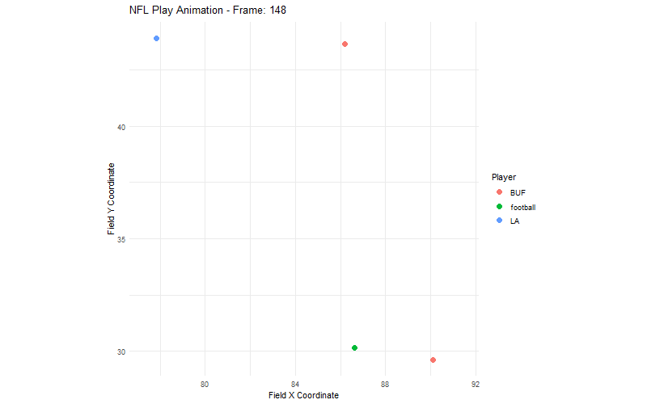

Figure 4: J.Allen pass short right to S.Diggs to BUF 31 for 6 yards.  
*2.2.2. Player Influence Openness*   
Our second metric tries to account for some of the potential shortcomings of considering only distance at a certain moment during a play. Consider a snapshot of a route runner and defender in two example plays.  

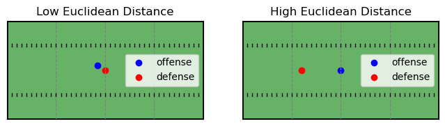

Figure 5: Left: Sample frame of low Euclidean distance. Right: Sample frame of high Euclidean distance.

Considering only the players’ positions, the first frame shows the players in close proximity, indicating that the offensive player failed to get open. The second shows the opposite, where the offensive player has separated from the defender, and therefore would be considered open.   
Our openness metric is based on the Player Influence model described by Fernandez et al \[4\], and the application to Big Data Bowl tracking data by Cheng et al \[5\]. Player influence is defined by a bivariate normal distribution, described by each player’s position, speed, and distance from the ball. Players moving faster extend their influence further in the direction of their velocity, and players with larger distances from the ball have influence over more space, which accounts for the time it would take for the ball to reach them. We illustrate an example of player influence with the same situations shown in Figure 5, according to two potential velocities added per frame. 

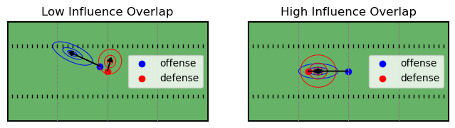

Figure 6: Left: Sample frame of low influence overlap. Right: Sample frame of high influence overlap.

We see in the sample frames that each player has influence over the area of the field that they are moving towards, which can be easily applied to route-running effectiveness. For example, in the first frame, we see that the Euclidean distance between the offensive and defensive player is quite small, but the offensive player’s momentum is carrying them forward, while the defender has not adjusted. To an NFL quarterback, the offensive player is open despite having a defender nearby. In the second frame, the offensive player is moving forward toward a defender about to occupy that same space, so they both exert influence over the same area. In the NFL, this offensive player would be considered covered, because the player’s momentum is carrying them into space occupied by defense, even though at the current frame, there are no immediate nearby defenders. Our openness metric considers the 1-standard deviation contour of the bivariate influence distribution as a player’s influence zone. Our final metric is calculated for each offensive player as the area of their influence zone occupied by a defender’s influence zone divided by the total area of the offensive player’s influence zone. This leverages our dataset’s high detail on player positioning and speed to quantify when offensive players are moving into open space. Openness was calculated on each individual frame in our data. An example visualization of openness is plotted below, which shows the offensive receivers in blue, and coverage defenders in red.   

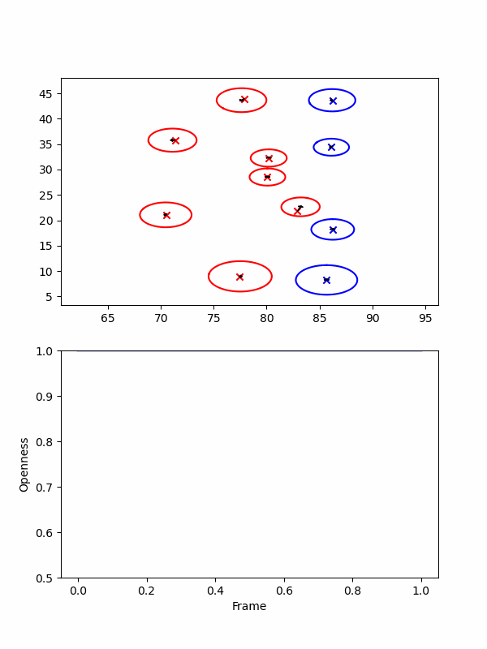

Figure 7:   
Top: Influence zones visualized for playId 56: “J.Allen pass short right to S.Diggs to BUF 31 for 6 yards.”  
Bottom: Openness per frame plotted for offensive players on playId 56\.

*2.3. Selecting Relevant Frames*  
Openness was aggregated on a per-play basis, but not every frame within a play is relevant when deciding receiver success. Players are likely to be wide open immediately after the ball is snapped, but depending on the route they are assigned to run, may not be targeted by their quarterbacks that early. To focus on frames where openness can be accurately measured and impactful on potential play success, we determined a range of “targetable frames” for each route type.    
To calculate this range of frames, we focused solely on plays where a receiver was targeted by the quarterback –this included any passing plays where the “pass forward” or “pass shovel” events occurred, which were marked in the tracking data. Within each of these plays, an extra column was added to track the number of frames from when the ball was snapped until the pass was thrown. By calculating the frames where targeted receivers tended to be thrown the ball, we were able to narrow down our frame of focus for players who were not targeted based on the route they were running. After grouping routes together and calculating the fifth and ninety fifth percentile of the number of frames until a pass for each type, as seen in Figure 7; a range of frames where openness could be more accurately determined for each route runner could be created. By using these percentiles as our targetable frame range, outlier plays where receivers were targeted unusually early or late were ignored. This allowed for a more reliable and robust identification of relevant frames to be analyzed than our previous method of breakpoint identification. 

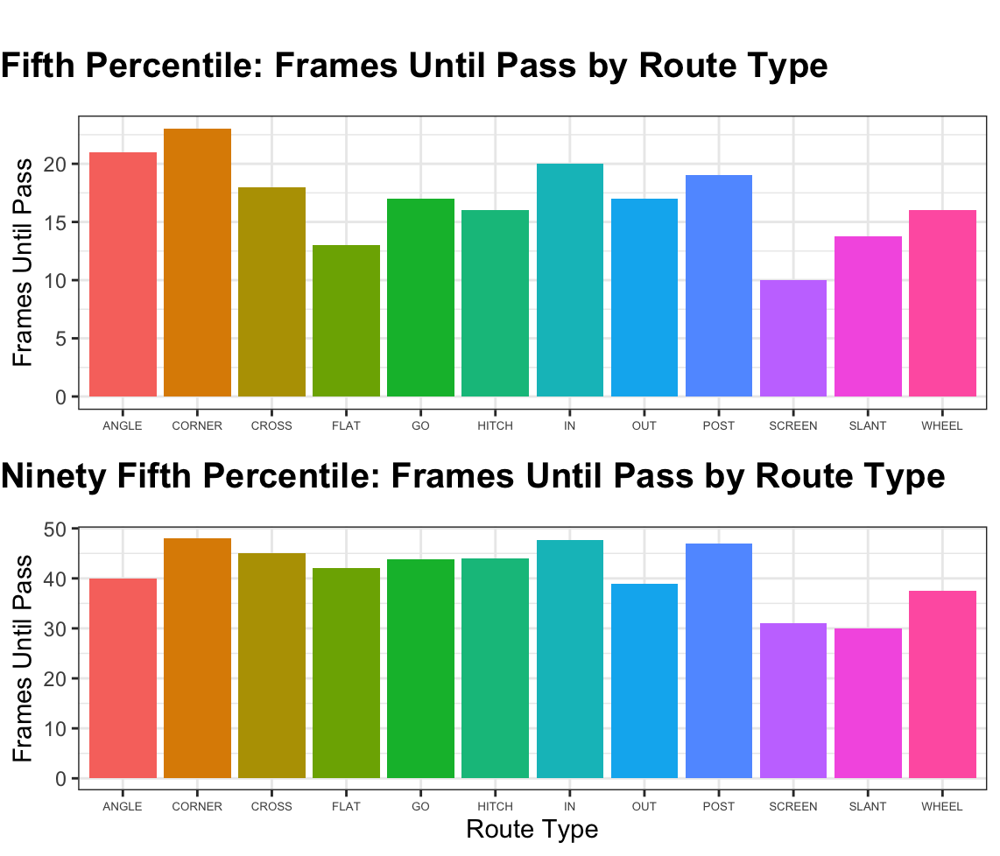

              Figure 8:  
Top: Fifth percentile of the number of frames after snap until a player was targeted, grouped by route type  
Bottom: Ninety fifth percentile of the number of frames after snap until a player was targeted, grouped by route type

For example, in all nine weeks of tracking data, targeted receivers running screen routes tended to not be thrown the ball before 10 frames had elapsed or after 31 frames had elapsed. So, for every player who ran a screen route, any rows that were less than 10 frames after the ball had been snapped or more than 31 frames after the ball had been snapped could be ignored when determining our openness metric. Any rows outside the targeted frame range would be representative of a value of openness that does not affect the play. A receiver’s separation from their defender in these moments is less relevant since, based on nine weeks of tracking data, quarterbacks weren’t throwing them the ball during these times.

	A player’s openness for a given play is calculated for the Offense Influence Zone IO, Defensive Influence Zones ID, Route *r*, and set of Targetable Frames Fr as follows:

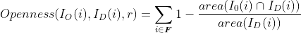

 *2.4. Evaluating Openness*  
	Quantifying player openness is critical to understanding receiver performance. Our approach uses a two-stage averaging process designed to reduce noise, highlight consistent patterns, and provide a stable measure of player effectiveness. First, within each play, we identify ‘influential’ frames and compute the average openness during these frames. This single per-play openness value succinctly captures how effectively a receiver separated from their defender during key moments in the play. However, player performance naturally fluctuates across individual plays due to factors such as defensive schemes, play designs, and game context. To derive more stable and reliable player-level measures of openness, we implemented two different levels of aggregation.  
First, we computed the average per-play openness score for each player across all plays during the nine-week period, resulting in a single aggregated openness value per player. This measure captures a player’s typical ability to create separation. Second we averaging per-play openness scores separately for each player and each distinct route type. This produced an openness value for every player route combination, allowing for a more granular analysis of how players' openness varies by route type. These two aggregation strategies help mitigate the effects of play-to-play variability and enable both overall and route-specific evaluations of player performance.  
Recognizing that player roles and physical characteristics differ substantially by position, we further stratify the analysis by analyzing wide receivers, running backs, and tight ends separately throughout all models.

*2.4.1.Aggregated Openness on Player*  
In the first aggregation, we calculated the average openness across all plays a player was involved in during the week. We then built linear regression models for each position group (WR, RB, TE) to relate players' openness scores to their physical characteristics and speed-based Combine metrics.  
Each model used normalized predictors: 40-yard dash, 3-cone drill, shuttle run times, player height, and weight. The models were specified without an intercept, as including an intercept led to poor model fits and had little conceptual meaning in this context. Because players differ substantially in the number of routes they ran, some participated in hundreds of routes and others in less than 10, it was important to account for this variation when aggregating openness. Therefore, when modeling, we applied weights proportional to the number of routes each player ran.  
Given the nature of the predictors, height, weight, and performance in multiple speed and agility drills we initially anticipated a high degree of multicollinearity among variables. However, variance inflation factor analyses revealed that multicollinearity was less severe than expected across all three position groups. All VIF values can be found in table 2\.

| Position | Height  | Weight  | 40-yd dash  | 3-cone | Shuttle  |
| :---- | :---- | :---- | :---- | :---- | :---- |
| WR | 1.95 | 1.99 | 1.20 | 1.72 | 1.71 |
| RB | 1.71 | 1.77 | 1.26 | 2.25 | 2.09 |
| TE | 1.45 | 1.64 | 1.41 | 1.35 | 1.51 |

Table 2: Summary of VIF values for each position specific model

Since all VIF values are well below the commonly cited threshold of 5, multicollinearity is unlikely to meaningfully bias our regression estimates. Therefore, we retained all five predictors in subsequent modeling without modification.

*2.4.2. Aggregated Openness on Player and Route Ran*

	Our approach to quantifying player openness involves two stages of averaging that serve to mitigate noise and highlight consistent patterns in player performance. Within each play, we select only the ‘influential’ frames and compute the average openness over the time interval. Our goal with the single aggregated value per play is to succinctly represent the overall openness of each player during the most influential moment of the play. We hope to see that if a player is open during these influential moments, their performance as a receiver will be higher than if they weren’t open.  
Player performance can fluctuate from one play to another due to various factors such as play-calling or opponent strategy. To capture a reliable and stable measure of a player’s typical performance, we further average the per-play openness scores of all routes run per player over the week. This second-level aggregation—the double means—reduces the influence of outlier plays and emphasizes consistency over time. By summarizing performance across multiple plays, we obtain a comprehensive metric that reflects both a player's typical ability to consistently create or exploit space.  
Together, these dual averaging steps provide a refined measure that is less sensitive to random variation while still capturing the critical aspects of player performance. This methodology supports more accurate comparisons and statistical analyses, ensuring that our openness metric is both representative and robust.  
	Given that performance and physical characteristics can vary by position, we split the analysis into three subsets corresponding to wide receivers, running backs, and tight ends. For each subset, we fitted individual linear regression models using normalized Combine metrics, the three speed drills, height, and weight as predictors to explain variations in the double mean openness. The models were specified without an intercept as including an intercept made for models with a very poor fit and the only significant coefficient being the intercept. Additionally, we think including an intercept in this case does not conceptually make sense in this context.  
	To ensure the robustness of our models, we first examined multicollinearity by calculating variance inflation factors for the predictor variables. The only values of concern were, as expected, height and weight, with a VIF of approximately 2 to 3 depending on the model. We explored using BMI in place of height and weight to combat the high multicollinearity; however, BMI did not capture the nuanced differences in how height and weight impact player performance across positions. Diagnostic plots were then generated for each position-specific model to assess key assumptions such as linearity, homoscedasticity, and normality of residuals. However, there is some indication that our data may exhibit heteroscedasticity. For now, we have not made adjustments because the primary focus of our analysis is on understanding relationships rather than making precise predictions, and the overall model fit remains reasonable.

 ## 3\. Results
*3.1. Missingness in Player Combine Stats*  
	An important consideration in handling missing data is ensuring that imputation is statistically justified. To assess this, a Missing Completely at Random (MCAR) test was performed on the dataset, yielding a p-value of 0.35. This result provides strong evidence that the missing values in the Combine dataset occur randomly rather than systematically, supporting the validity of imputation. Furthermore, statistical comparisons were conducted using the Wilcoxon rank-sum test to evaluate differences in performance (measured by the number of routes run) across different groups: route runners with full participation in Combine speed events, route runners with at least partial participation in Combine speed events, and route runners who did not participate in Combine speed events. No statistically significant difference was found between players with complete speed Combine data and those missing at most two speed-related Combine metrics. However, a statistically significant difference, at a .05 level, was observed between players with full Combine participation and the remainder of the data, including those who did not participate in any speed drills. This difference, or lack of, in distributions can be seen in Figure 8\.  

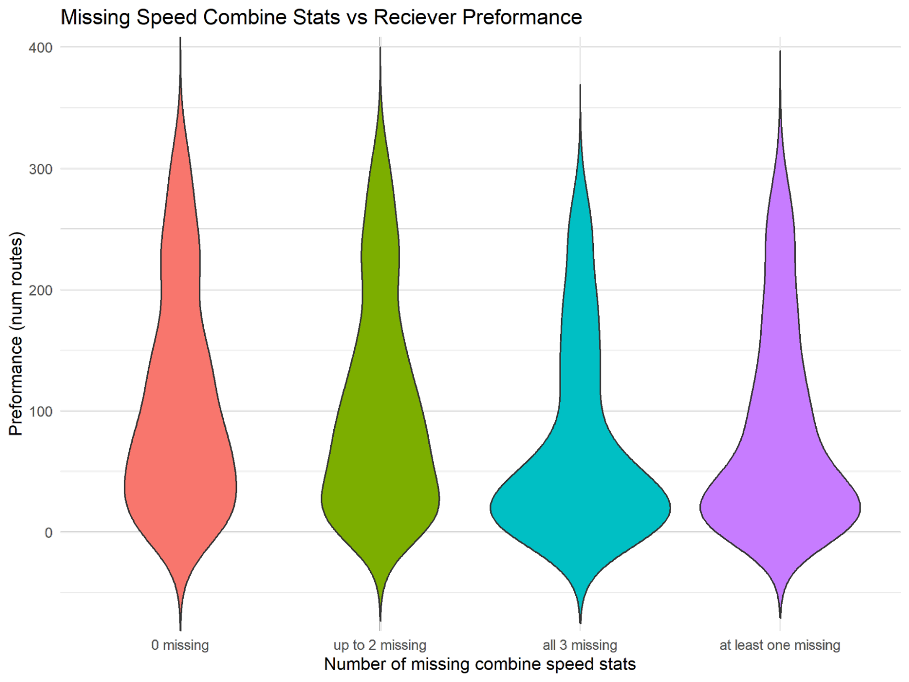

Figure 9: Proxy receiver performance (number of routes ran) split by Combine missingness

*3.2. Player Stats on EPA*  
	From our dataset where we measured on-field success by assigning a given play’s EPA to the targeted receiver, our analysis revealed there to be a very weak correlation between the Combine results and their success. These results can be seen in Figure 8, though this does not show correlation per route type, only based on position and drill.  

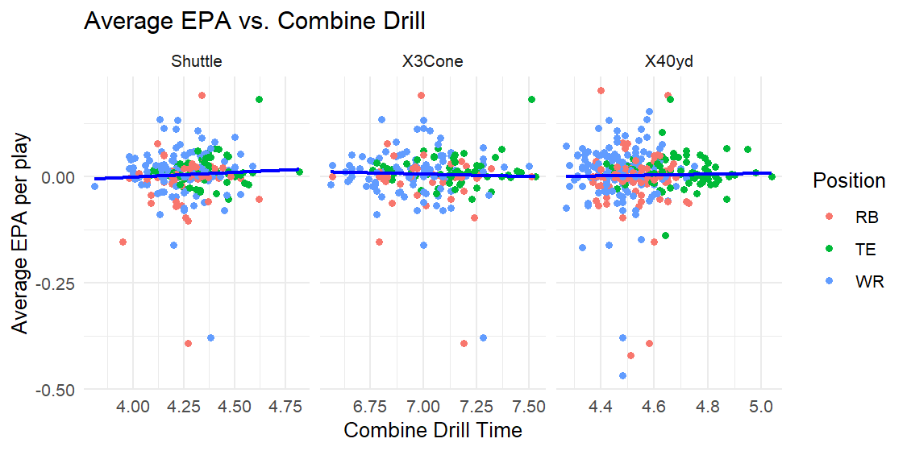

Figure 10: Average EPA per player vs. Combine drill, split by position

When looking at the coefficients and p values of the separate models on WR, TE, and RB, we find that they are not significant and do not account for much of the variability in average EPA. For our WR model, we had an R2 value of just 0.07 and a p-value of 0.14; for our RB model, we had an R2 value of just 0.05 and a p-value of 0.69; for our TE model, we had an R2 value of 0.11 and a p-value of just	0.29. Despite their statistical insignificance, most of the Combine drills coefficients were consistently negative, meaning that faster times on the drills tended to correlate, albeit weakly, with higher average EPA. This can be seen in Figure 9 which shows 95% confidence intervals around the calculated coefficients for each of the models.

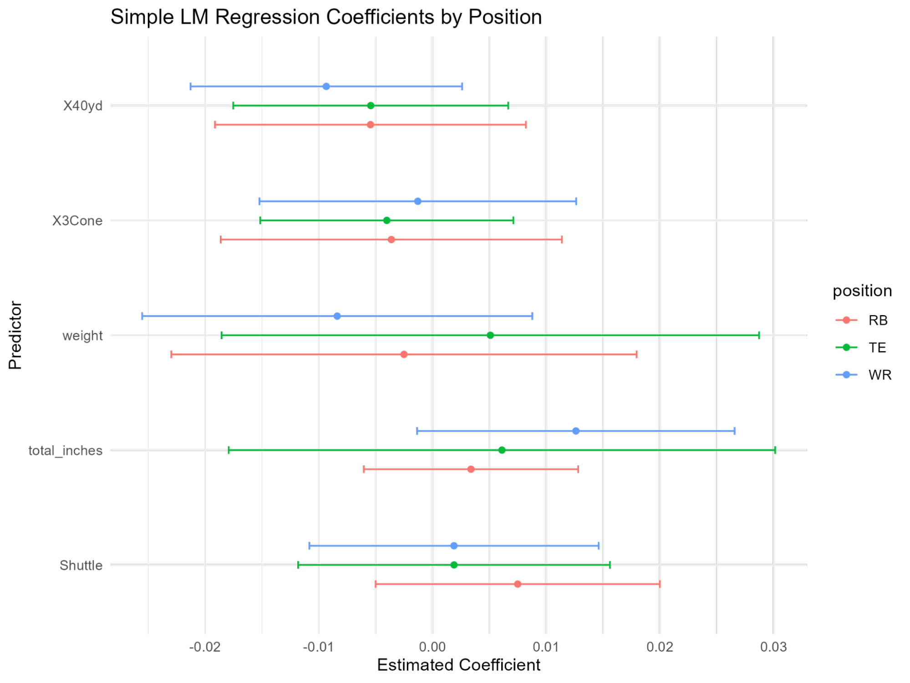

Figure 11: 95% confidence intervals of coefficients for EPA model by position

Due to this statistical insignificance and the known shortcomings of using EPA as an individual performance metric as previously discussed, we decided to pursue our other measure of openness further.

*3.3. Player Stats on Openness*

*3.3.1. Aggregated Openness on Player*  
	To better understand the relationship between Combine performance and receiver performance, we fit separate linear regression models for wide receivers, running backs, and tight ends using double mean openness as the response variable. In doing so, we aimed to better isolate individual receiver ability than when using EPA, which is more affected by team context.  
For wide receivers, the model explained 59.4% of the variance in openness (R² \= 0.594, Adjusted R² \= 0.575), with weight, height, and 40-yard dash times all being statistically significant predictors at the 0.001 level. The negative coefficient for weight suggests that lighter receivers tend to get open more often, while the positive coefficient for height implies that taller receivers may gain more separation from defenders. The negative association with 40-yard dash time supports the idea that faster wide receivers are generally more open.  
For running backs, the model showed a stronger overall fit (R² \= 0.752, Adjusted R² \= 0.730), with weight, height, and 40-yard dash again emerging as significant predictors (p \< 0.001). Interestingly, the direction of the effects differed from WRs: heavier and shorter running backs tended to have higher openness. Speed remained important, as faster running backs also showed greater openness.  
For tight ends, the model achieved the highest explanatory power (R² \= 0.942, Adjusted R² \= 0.936). Weight was a strong positive predictor (p \< 0.001), while both 40-Yard Dash and 3-Cone drill times were also significant (p \< 0.02), though with smaller effect sizes. Unlike the other positions, height did not reach statistical significance for tight ends, suggesting that agility and weight play a more important role in separation for this group. Notably, tight ends were the only position for which a drill other than the 40-yard dash—the 3-Cone—was significant, indicating that agility may be more critical for this group than raw speed alone.  
For all models in this section, the coefficients’ magnitudes are not interpretable, as our dependent variable, openness, is interpretable, and our player combine metrics are normalized.  

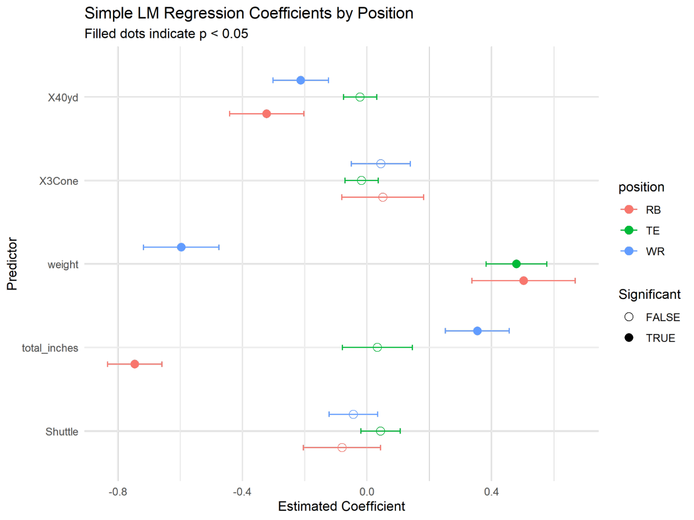

Figure 12: Regression model results for double mean openness, showing the relationship between Combine performance and openness across positions

Overall, these results suggest that the physical traits contributing to openness vary by position. Raw speed, as measured by 40-yard dash time, is consistently important, but the impact of weight and height is more position-dependent. Additionally, agility, as measured by the 3-Cone drill, appears to be a meaningful factor only for tight ends, suggesting that agility may play a larger role in their ability to separate from defenders compared to wide receivers and running backs. These trends are visualized in Figure 10, which illustrates the estimated effects of Combine performance metrics on openness and how they differ from position to position.

*3.3.2. Aggregated Openness on Player and Route Ran*  
	  
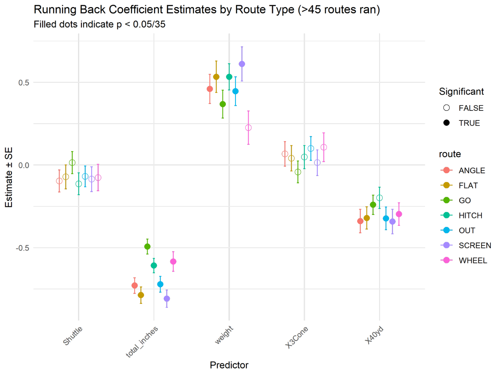

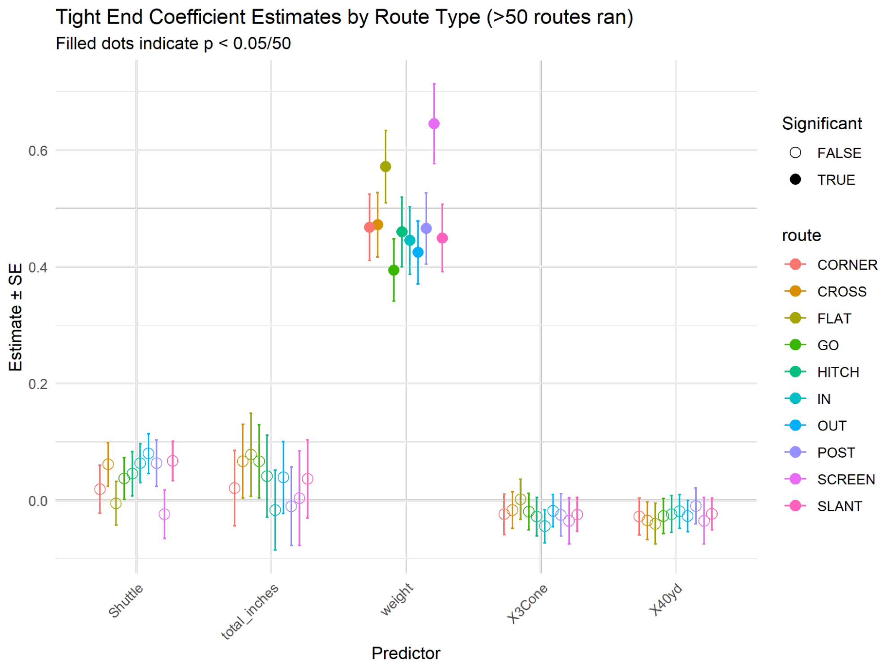

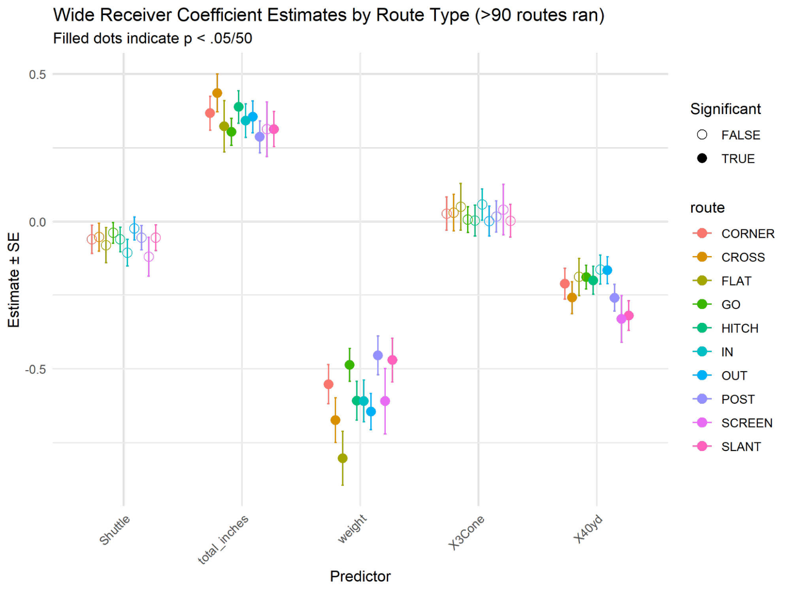

*3.4. Sensitivity Due to Imputation*  
	As discussed in Section 2.1.1, many players in our dataset had missing values for one or more Combine metrics. To maximize sample size and preserve statistical power, we used multivariate imputation to fill in these missing values. While imputation allows us to include more players in the analysis, it can potentially introduce bias or dampen true variability, especially if missingness is not completely random.  
To test how sensitive our results were to this step, we re-estimated the regression models on a subset of players who had complete Combine data and required no imputation. Across all positions, the models fit on fully observed players yielded coefficient estimates and significance patterns similar to those from the imputed models. Some variables (e.g., shuttle or 3-cone times) continued to show limited or inconsistent associations regardless of whether imputation was used.  
This sensitivity analysis strengthens our confidence in the modeling results. While some degree of uncertainty is unavoidable when working with incomplete data, our key findings appear robust to the method used to address missingness. It also suggests that the missing Combine data, while not entirely random, did not drive the overall structure of the results.

**4\. Discussion**

Using Combine metrics to predict EPA per play failed to identify any drills or attributes significant to higher-performing players. We speculate that this is due to the difficulty of attributing success to plays where individual players do not participate in any of the offensive actions. It is likely that without using an outcome-agnostic measurement like openness, we would never see a significant impact of Combine athleticism scores because there are just too many other factors at play.   
	Our final model regressing on openness supports this claim, showing results that mimic what we might expect to see as NFL observers. Combine measured height and weight contributes significantly to average openness for all positions, with the more physical running back and tight end positions favoring heavier players. Agility tests had weaker contributions to openness but were statistically significant among tight ends and running backs for the 40-yard dash, the highest-profile event for these positions.   
	Attempting to quantify NFL player athleticism through Combine statistics introduces several potential pitfalls. First, Combine events are publicly measured only once for any individual player over the course of an NFL career, which means that the scores available to the public may not be applicable to every current player, as they potentially regress in raw athleticism or alter their body type and play style. Prospects preparing for the Combine often go to extreme measures to add small increases to their Combine measurements in hopes of increasing their draft stock. Undersized receiver Emmanuel Sanders famously drank 2 gallons of water before weighing in, which increased his body weight by around 10%, in hopes of appearing more capable of handling NFL physicality. Combine drills are measured in perfect conditions, without equipment, among completely rested players, and ignore the fatigue and variable conditions that appear in real NFL scenarios.   
	Our openness metric may also introduce some pitfalls in our analysis. The Player Influence model makes the assumption that every player has the same amount of influence over the field, controlling for speed and position. However, this may not be as applicable in the NFL. Some more agile players are able to change direction much quicker than others, and thus may, in reality, extend their influence beyond the shape assumed by the player influence model. This, in turn, affects our modeling, because these differences in agility that we are trying to measure may not appear pronounced in our openness results.   
	Despite this, our research shows promising results in correlating for equating Combine success to specific on-field actions \- a different approach compared to other research on the Scouting Combine. Many scholarly papers attempt to analyze player career success or draft position, which tend to have mixed results, as described in Frank et al.\[6\], instead of narrowing the scope as we describe.   
Future work in this specific area of NFL Combine analysis may benefit from a further narrowing of scope as well as an increased sample size. Our paper does not draw any conclusions on the correlation between agility testing scores and on-field movement patterns that the tests attempt to represent due to limitations on data availability and computing time. More tracking data and spatial analysis beyond the scope of this paper could provide insight into the effect of Combine agility on specific in-game movements, and including more seasons of tracking data could allow future work to analyze more Combine scores. 

**5\. Conclusion**

	Our findings showed very little correlation between a player's average EPA and performance in the three Combine drills. We believe that this is likely due to the nature of EPA as a metric. Since EPA is representative of an entire team, as opposed to the individual players that we were focused on evaluating, it was unable to be completely accurate in determining receiver success in games. There were, however, non-significant outcomes from our analysis that were conducive to what we would expect from a player success metric. Several of the regression coefficients for Combine drills showed a weak direct relationship between lower player drill times and higher average EPA.   
	On the other hand, we were able to find a few significant relationships between average player openness and Combine measurements. Notably, we found that for each of our focus positions, height, and weight were almost always meaningful in indicating openness. Our findings reinforce a very common belief that size does play a role in player production in the NFL. In our analysis, we found that heavier running backs and tight ends; and taller, lighter wide receivers tended to get more separation from defenders. We were also able to find significant relationships between average openness and 40-yard dash results among wide receivers and running backs.  
	The conclusions we drew from our analysis could be improved and built upon by exploring these metrics across a larger sample size, possibly over the course of several full-length NFL seasons. Additional improvements could be made in developing metrics to accurately assess route runner performances in games. In other sports, there are existing examples of great single-player performance metrics, like Baseball’s Wins Above Replacement (WAR) statistic–which quantifies each player’s overall contribution to their team.   
	One of the toughest parts of building successful, long-lasting dynasties in the NFL is choosing which players to draft. Teams lean on analytics to varying degrees to try and determine who will be able to make positive contributions in the league. Even NFL teams, which have nearly endless access to data and resources, are almost never able to choose 7 successful NFL players in a given year. For example, the Cleveland Browns, who are known for relying heavily on analytics to choose their future players, have had very little recent success. Although the Combine may not be completely indicative of how well a player will perform, it is still a good way to compare athletes to one another. By finding trends and relationships between these drills and performances in games, the NFL can continue to improve the setup of the Combine to most accurately demonstrate the capabilities of potential players.

**6\. References**

\[1\]	 “NFL Scouting Combine | NFL Football Operations,” *operations.nfl.com*.   
https://operations.nfl.com/journey-to-the-nfl/the-next-generation-of-nfl-stars/nfl-scouting  
\-combine/

\[2\]	“NFL Big Data Bowl 2025,” *@kaggle*, 2024\.   
	https://www.kaggle.com/competitions/nfl-big-data-bowl-2025/overview

\[3\]	“Pro Football Statistics and History | Pro-Football-Reference.com,”   
	*Pro-Football-Reference.com*, 2018\. https://www.pro-football-reference.com/

\[4\] 	J. Fernandez, F. Barcelona, and L. Bornn, “Wide Open Spaces: A statistical technique for   
measuring space creation in professional soccer,” 2018\. Available: https://static.capabiliaserver.com/frontend/clients/barca/wp\_prod/wp-content/uploads/2018/05/Wide-Open-Spaces.pdf

‌\[5\]	Matthew Chang, Katherine Dai, Daniel Jiang, Harvey Cheng, “Uncovering Missed   
	Tackle Opportunities,” Kaggle.com, Feb. 02, 2024\.   
	https://www.kaggle.com/code/matthewpchang/uncovering-missed-tackle-opportunities/   
	(accessed Apr. 03, 2025).

‌\[6\]	D. Frank, M. King, C. Dennard, and B. Macnamara, “Discriminant Function Analysis   
	Reveals Which Combination of Measures from the NFL Scouting Combine Predict NFL   
	Performance.” Accessed: Apr. 03, 2025\. \[Online\]. Available:   
	https://hhs.purdue.edu/skill-learning-and-performance-lab/wp-content/uploads/sites  
	/43/2024/08/Franketal2023.pdf

‌
